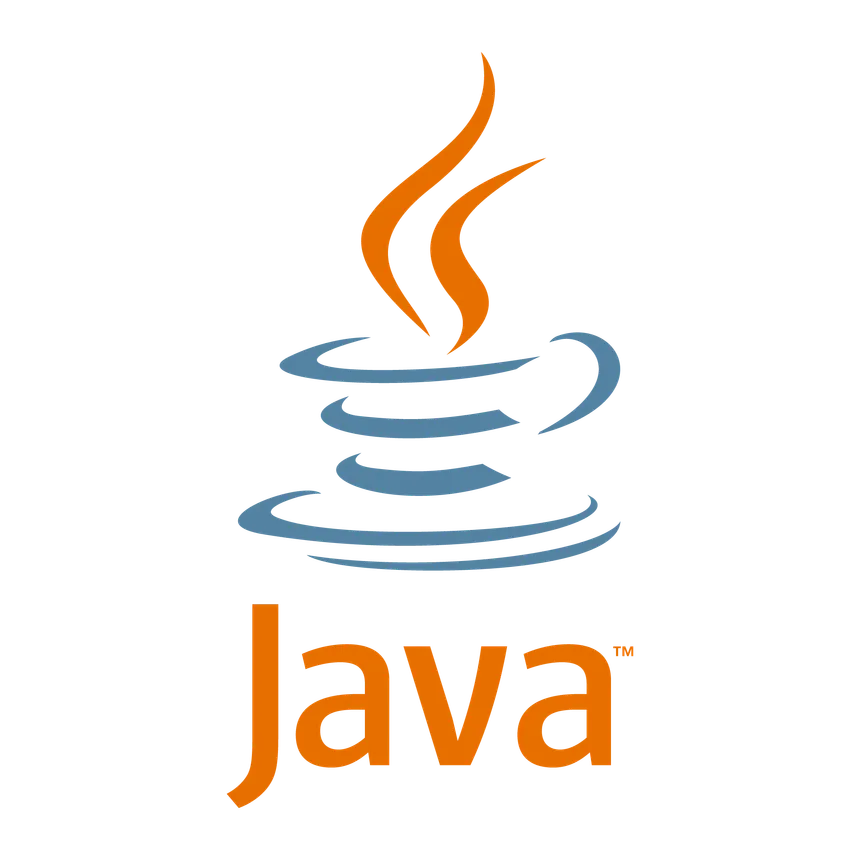

# site-java-html-css
# Página sobre Java

## Descrição

Esta página fornece uma visão abrangente sobre a linguagem de programação Java, abordando seus principais aspectos e conceitos. O conteúdo é dividido em várias seções informativas que cobrem:

- **Sobre a Linguagem**: Um panorama geral da história e das características fundamentais do Java, desde seu desenvolvimento na Sun Microsystems até sua aquisição pela Oracle Corporation.
- **Como é Usado**: Explica a tipagem estática de Java e a verificação de tipos durante o desenvolvimento.
- **Importante**: Destaca a riqueza das bibliotecas de Java e a importância de sua comunidade ativa.
- **Programação Orientada a Objetos**: Introduz os conceitos de programação orientada a objetos e como Java aplica esses conceitos.
- **Packages**: Explica o conceito de pacotes em Java e como eles ajudam na organização do código.
- **Classes**: Descreve o papel das classes como modelos para a criação de objetos.
- **Objetos**: Detalha o conceito de objetos dentro de classes e suas características.
- **Instância**: Fala sobre a criação de instâncias de classes e a importância desse processo.
- **Encapsulamento**: Explica o conceito de encapsulamento e como ele promove a reutilização e a segurança do código.

# Página de Exercícios Iniciantes

## Descrição

Esta página é dedicada a fornecer exercícios práticos para iniciantes em programação, com foco na linguagem Java. Cada exercício é acompanhado por uma descrição clara e uma solução visual para ajudar na compreensão.

### Exercícios Disponíveis

1. **Exercício Iniciante #1**: Converta uma temperatura em graus Celsius para diferentes escalas de temperatura, incluindo Kelvin, Réaumur, Rankine e Fahrenheit. As fórmulas fornecidas facilitam a conversão.

   - **Descrição**: Escreva um programa para converter a temperatura em várias unidades.
   - **Solução**: Uma imagem com a solução para este exercício está disponível para referência.

2. **Exercício Iniciante #2**: Calcule estatísticas com base em um conjunto de dados sobre altura e sexo de 10 pessoas. O exercício inclui encontrar a maior e menor altura, a média de altura dos homens e o número de mulheres.

   - **Descrição**: Desenvolva um algoritmo para analisar dados de altura e sexo.
   - **Solução**: A solução é ilustrada em uma imagem para facilitar o entendimento.

3. **Exercício Iniciante #3**: Crie um programa para calcular a média salarial de uma empresa, solicitando ao usuário a quantidade de funcionários e seus salários.

   - **Descrição**: Elabore um programa para calcular a média salarial com base em entradas do usuário.
   - **Solução**: A imagem fornecida mostra a solução para este exercício.

# Página de Animação
## Descrição

Este é um site com um design visualmente impactante e interativo. O fundo da página apresenta uma animação de LEDs piscantes que cria um efeito de iluminação vibrante e dinâmico. 

No centro da página, uma imagem flutuante de logo está animada para se mover suavemente para cima e para baixo, adicionando um toque de elegância ao layout.

O site inclui dois botões com links para outras páginas:

- **Botão no Canto Superior Direito**: Um botão estilizado que redireciona para a página principal ou qualquer outra página especificada.
- **Botão na Parte Inferior Direita**: Outro botão estilizado, posicionado na parte inferior direita da página, para navegação adicional.

Além disso, um rodapé no canto superior esquerdo exibe uma imagem de logo, destacando a identidade visual do site.

## Recursos

- **Animação de LEDs**: LEDs piscando em um padrão de grade para criar um efeito de fundo iluminado.
- **Imagem Flutuante**: Uma imagem que flutua suavemente no centro da página, criando um efeito visual agradável.
- **Botões Interativos**: Botões bem posicionados e estilizados para navegação fácil.
- **Design Responsivo**: O layout se adapta a diferentes tamanhos de tela e dispositivos.

## Tecnologias Utilizadas

- **HTML**: Estrutura básica da página e elementos.
- **CSS**: Estilização e animações para uma apresentação visual atraente.
- **JavaScript**: Geração dinâmica dos LEDs e outras interações.

## Visual

## Navegação

- [Sobre a Linguagem](index.html)
- [Exercicios](exercicios.html)
- [Animação](animacao.html)

---

Desfrute da experiência interativa e visual do nosso site!
